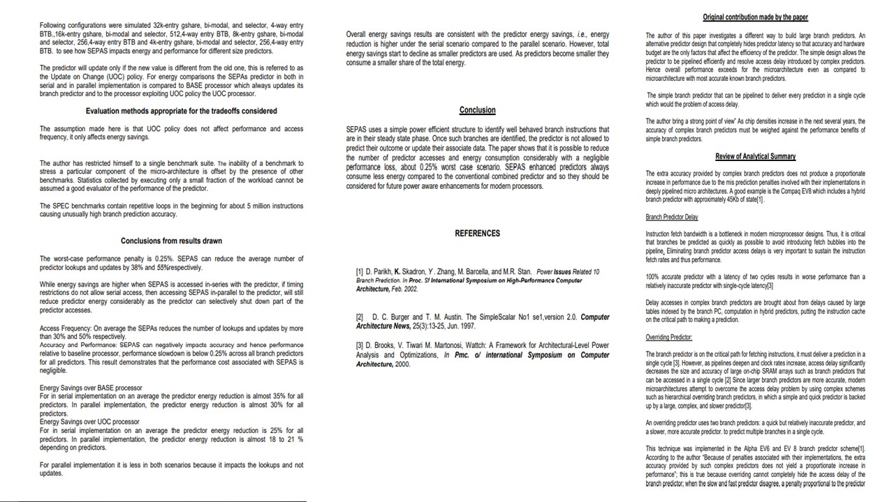

# Microarchitecture

The project consists of an overview of microarchitecture. For details launch the executable from https://github.com/alpaddesai/Microarchitecture/releases

All images are either custom by Alpa D Desai or a reference name is included. Most of the images are custom. Company confidential information is not displayed

## Overview

## Fundamentals

## Parallelism

## Pipeline Concepts

## Interest : Critical reviews on self-selected papers

Additional details : https://github.com/alpaddesai/ArchitecturalProductDesign
